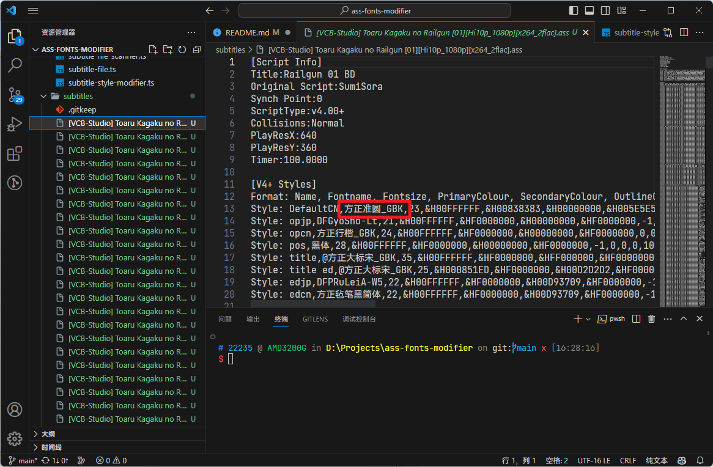
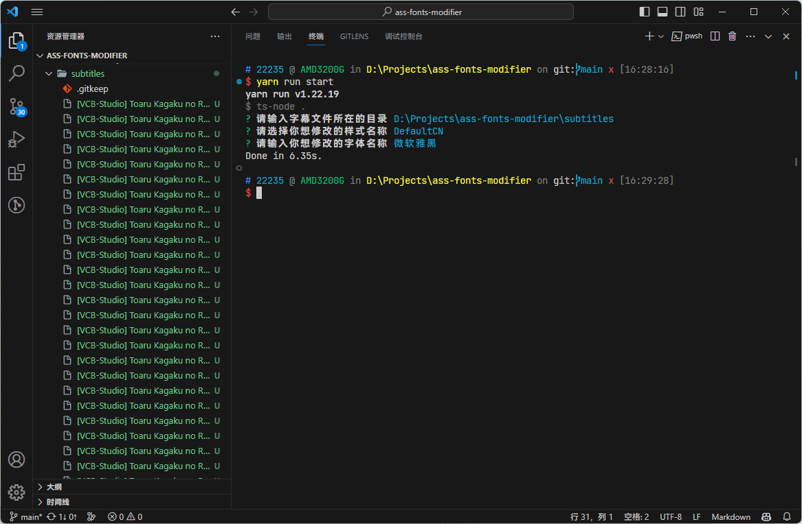
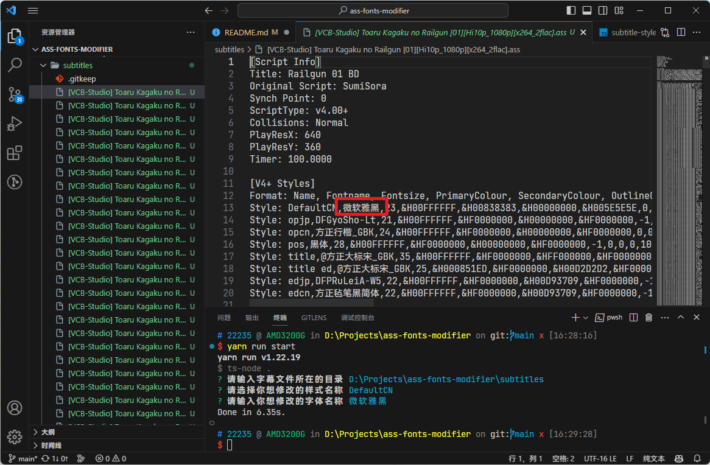

# ASS Fonts Modifier

批量替换 `.ass` 字幕文件中特定样式的字体名称，使字幕使用你选择的字体显示，而不需要安装特定字幕的字体

## Usage

1. 安装依赖

```
yarn install
```

2. 将需要修改的字幕文件放置在同一个目录下（或者本项目文件夹下的 `subtitles` 目录）

3. 运行程序

```
yarn run start
```

4. 输入字幕文件所在的目录（如果放在本项目中的 `subtitles` 目录直接回车就行）

5. 选择你想修改的样式名称

6. 输入你想修改的字体名称

当以上步骤完成后，你的字幕文件目录中的所有字幕文件的字体已经被替换为你输入的字体

## Example

### Before



### Input



### After


